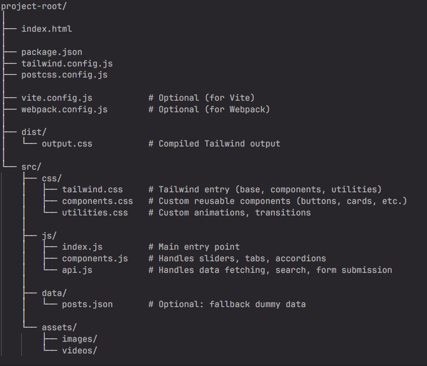

# Responsive and interactive website

## Objective:
Implement a responsive, accessible, and visually appealing website from a provided Figma design (choose any one) using Tailwind CSS, while enhancing it with modern UI/UX features such as sliders, accordions, tabs, form validation, dynamic content loading, and search functionality.

### Design Reference:
Figma Link:  https://epa.ms/gB0K8 (choose any one)

## Requirements:
### Styling & Layout (Tailwind CSS):
- Use Tailwind CSS consistently for layout and styling. 
- Break UI into reusable components: Header, Footer, Hero, Cards, Buttons, etc. 
- Ensure full responsiveness across mobile, tablet, and desktop using Tailwind's responsive utilities. 
- Match the Figma design precisely: spacing, typography, color palette, etc. 

### Interactive Features (JavaScript):
- Hero Image Slider: Convert the hero image section into a responsive slider. 
- Section Sliders: Add sliders to other relevant sections like testimonials, destinations, or featured posts. 
- Tabs: Implement tab switching functionality for multi-view sections. 
- Accordion: If not present in the design, add a new accordion-based FAQ or info section inspired by modern designs. 

### Forms:
- Make forms fully functional with proper validation (required fields, email format, etc.). 
- Show success/error messages upon submission. 

### Dynamic Content:
- Fetch blog posts or content dynamically using: 
- Dummy APIs (e.g., JSONPlaceholder) or Custom JSON data simulating APIs.
- Render fetched data into card/list/grid components. 

### Media Enhancements:
- Replace static images with videos where applicable to enhance UX. 

### Search Functionality:
- Implement a search bar that fetches and filters content from dummy API or JSON data. 

### JavaScript Event Handling:
- Add custom event listeners: 
- Subscribe form submit → triggers validation and submit handler.
- Other buttons (e.g., search or tabs) should handle appropriate events.

### Accessibility & Performance (Optional):
- Use semantic HTML5. 
- Ensure keyboard navigation and screen reader compatibility. 
- Optimize media and assets for fast load times.

## Deliverables
### Project structure (recommended)

### Instructions
1. Keep all your website components within components.js.
2. Avoid creating too many JavaScript files — this helps GIT AI evaluate your code more effectively and provide accurate feedback.
3. If you encounter a "token exceeding" error during GIT AI evaluation, try reducing the number of JavaScript files by combining them into 2 or 3 files

